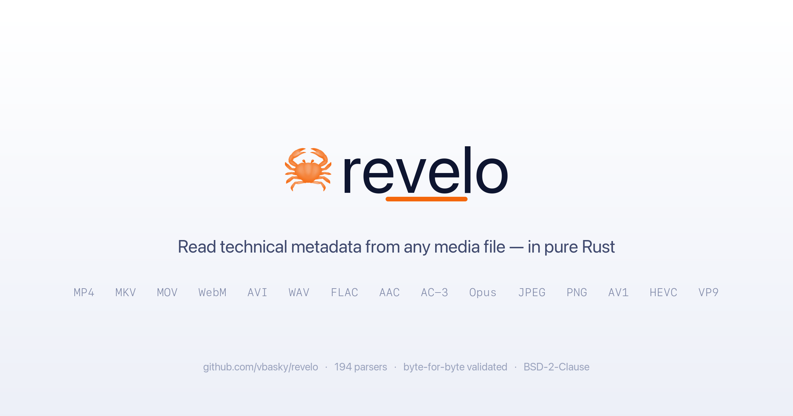

# Porting 300,000 Lines of C++ and Perl to Rust: A Dual-Oracle Media Metadata Engine

**Vikram Bhaskaran** · 16 min read



How I replaced both a 25-year-old C++ media analyzer and a 30-year-old Perl EXIF
tool with a pure Rust library — matching their output byte-for-byte and tag-for-tag,
while making it faster, safer, and installable with `cargo install`.

---

## The Problem

Every video and photo file carries hidden metadata. Codec profiles, color spaces,
HDR luminance values, frame rates, audio channel layouts, bitrates, encoder
settings, GPS coordinates, lens specifications, maker-note camera settings. For
decades, two tools have been the undisputed standards:

- **MediaInfoLib** (C++): extracts container/codec metadata from ~200 media formats
- **ExifTool** (Perl): extracts EXIF/maker-note metadata from thousands of camera models

Both work. Both are painful to integrate.

### MediaInfoLib

Try adding it to a modern project. First you build it — `./Configure && make && make install`,
which pulls in 10+ system library dependencies (zlib, libcurl, libmms, libzen,
libtinyxml2, and more). Each has its own version constraints. If you're on macOS,
Homebrew helps. On Windows, you're in for a bad afternoon. In CI, every container
image needs the full toolchain. Cross-compile? Good luck.

Integration options:

- **Shell out** as a subprocess, capture XML, parse it back. Lose type safety, pay
  the serialization round-trip, error handling is "parse the stderr string."
- **Link via C ABI**. Manage a native dependency across platforms. The C ABI was
  designed for C++ consumption — `char*` output buffers, manually-managed handles,
  integer stream kind discriminants you must get exactly right.

### ExifTool

Written in Perl. Amazing tool — 30,000+ tags, 50+ camera makes. But embedding it
means shipping a Perl runtime, managing CPAN dependencies, and accepting that your
parser lives in a scripting language with no memory safety guarantees.

Both codebases touch attacker-controlled binary data. 200,000 lines of C++ and Perl
parsing crafted MP4 boxes and EXIF IFDs. Every file is a potential exploit vector.

This is exactly the problem Rust was built to solve.

---

## The Challenge: Not One Oracle, But Two

Let me be clear about what "port" means here. This is not a wrapper. It's a complete
from-scratch reimplementation in Rust that produces:

- **Byte-identical XML output to MediaInfoLib** — every field name, decimal
  separator, `<extra>` bucket, field ordering identical.
- **95–100% tag parity with ExifTool** — for 14 camera vendors, validation against
  the `exiftool` binary shows exact tag name and value matches on real camera files.

Two reference tools' worth of metadata, in one pure-Rust crate.

### Why Both?

They solve different halves of the same problem:

| | MediaInfoLib | ExifTool |
|---|---|---|
| **Strengths** | Containers, codecs, streaming formats | Photo metadata, EXIF, GPS, maker-notes |
| **Weaknesses** | Basic EXIF only (folded into `General`) | Limited container/codec depth |
| **Lines** | ~200,000 C++ | ~100,000 Perl |
| **License** | BSD-2-Clause | GPL/Artistic |

A complete media metadata solution needs both. Before revelo, that meant shipping
two external tools and managing two integration layers.

---

## Architecture: From Virtual Classes to Function Pointers

The most visible design change: instead of a C++ class hierarchy, revelo uses a
flat table of 194 function pointers:

```rust
pub fn table() -> [fn(&mut FileAnalyze) -> bool; 194] {
    [
        parse_wav,       // WAV
        parse_mp4,       // MP4/MOV
        parse_mkv,       // Matroska
        parse_hevc,      // HEVC
        parse_jpeg,      // JPEG + EXIF
        parse_exif,      // EXIF IFD walker
        // ... 188 more
    ]
}
```

Every parser is `fn(&mut FileAnalyze) -> bool`. No traits, no vtables, no
subclassing. Each parser is standalone, independently testable, and trivially
parallelizable.

### Race + Walk

All 194 parsers race across CPU cores using rayon's work-stealing thread pool:

```rust
pub fn detect(bytes: &[u8]) -> Option<fn(&mut FileAnalyze) -> bool> {
    table()
        .par_iter()
        .find_first(|&&parser| {
            let mut fa = FileAnalyze::new(bytes);
            parser(&mut fa)  // cheap detection: peek magic bytes
        })
        .copied()
}
```

Detection is just checking magic bytes — WAV checks for `RIFF`, MP4 checks `ftyp`
box, JPEG checks `0xFFD8`. Each candidate finishes in microseconds. On an 8-core
machine, the entire 194-format race completes in under a millisecond.

Once detected, the winner runs again for full extraction. Two passes: parallel
sprint, then single-threaded deep parse.

### What Makes This Hard: Media Parsing Is Inconsistent by Design

Media files aren't cleanly-specified formats read by well-behaved parsers. They're
the product of 30 years of competing standards committees, vendor extensions, and
"it compiles, ship it" engineering.

**MP4/MOV** is nominally a tree of boxes, each with a 4-byte size and 4-byte type.
But some boxes use `0` as a size meaning "rest of file." Others use `1` as a flag
meaning "the real size is in the next 8 bytes" (64-bit extended size). The `stsd`
sample description box is a container whose children vary by codec type — `avcC`
for H.264 stores an SPS/PPS blob, `hvcC` for H.265 stores a VPS/SPS/PPS combo with
completely different bit-packing, `dvcC` for Dolby Vision has its own versioning,
and `esds` for AAC contains a recursive ISO 14496-1 descriptor hierarchy
(DecoderConfigDescriptor → DecoderSpecificInfo → SLConfigDescriptor) that must be
parsed depth-first.

**Matroska/WebM** uses EBML elements with variable-length integer-encoded sizes. The
size encoding is elegant — the number of leading zeros in the first byte tells you
how many bytes follow — but decoding it requires bit-level manipulation. A single
Segment element can span terabytes with nested seek indexes, track definitions,
chapters, tags, attachments, and CueSeekPositions all as sibling elements.

**MPEG-TS** is a flat stream of 188-byte packets. Each packet has a PID identifying
its stream, but the PAT (PID 0) and PMTs must be parsed to know which PID carries
video, which audio, and which subtitles. The PMT itself contains nested descriptors
— some simple (4 bytes, language code), some complex (AC-3 descriptor with
bitstream mode and channel configuration). You can't rely on the PMT appearing at a
fixed position; you have to scan continuously.

**RIFF (AVI/WAV)** uses little-endian chunk sizes, which is fine until you encounter
a WAV file with an odd-sized `fmt` chunk and need to handle the word-alignment
padding byte exactly as the C++ code does. Or a Broadcast Wave `bext` chunk whose
specification includes a field that is literally "372 bytes of reserved space, must
be zeroed."

**Bitstream-level parsers** are the worst. HEVC SPS parsing requires extracting
`log2_max_pic_order_cnt_lsb_minus4` from a ue(v) (unsigned exponential
Golomb-coded integer), which itself must be decoded bit-by-bit: count leading zeros,
read that many data bits, add 1, subtract 1. H.264 has a similar scheme with
completely different parameter names and semantics. AV1 uses a different OBU (Open
Bitstream Unit) structure entirely. Each codec has its own bit-packing conventions,
and none of them align with byte boundaries.

Each container format requires a fundamentally different walking strategy. I chose
not to abstract over them — every container walks its native on-disk structure
directly. The output model is the same `StreamCollection` — they all write into the
same data structure — but the walk code maps directly to the format specification.

### The Porting Process

I started every parser as a transliteration of the C++ source, then iteratively
refined through differential testing:

1. **Find sample files** — real-world media, sometimes generated with specific
   encoder settings for obscure formats.
2. **Run the oracle** — `mediainfo --Output=XML sample.file`. Save ground truth.
3. **Read the C++ source** — `File_*` class, `Header_Parse()` and `Data_Parse()`
   flow, transliterate field-by-field into Rust.
4. **Compare output** — `cargo run -p revelo-diff -- sample.file`.
5. **Fix discrepancies** — mismatched field names, wrong byte order, wrong bit
   offsets, wrong value formatting. Every mismatch is a bug.
6. **Commit** — once `--strict` reports byte-equal.

Some parsers came together in hours. The MP4 container parser — with dozens of
sub-box types — took weeks. The hardest bugs were the ones where output looked
right but the bytes didn't match: a field rendered as `"48000"` instead of
`"48 000"`, or appearing in the wrong XML element order because the C++ code
`Fill()`-s fields in a different sequence than alphabetical.

### The FileAnalyze Engine

The engine wraps the raw buffer and provides the read API every parser uses. I
kept MediaInfoLib's C++ API naming — `get_b1` through `get_b8` for big-endian,
`get_l1` through `get_l8` for little-endian, `get_c4` for four-character codes,
`bs_begin()`/`bs_end()` for bitstream mode — so I could compare the Rust port
against the C++ original side-by-side without mental translation.

The read API is comprehensive — everything from single-byte peeks to 80-bit IEEE
754 extended precision floats (AIFF format uses these):

- **Big-endian**: `get_b1` through `get_b8`, `get_b16`, `peek_b*`, `skip_b*`
- **Little-endian**: `get_l1` through `get_l8`, `get_l16`, with peek/skip variants
- **Floats**: `get_bf4`, `get_bf8`, `get_bf10` (80-bit extended precision)
- **Bitstream**: `bs_begin()`/`bs_end()` bracket bit-aligned reads with `get_s1`
  through `get_s8` (MSB-first)
- **4CC**: `get_c4` reads 4 bytes as big-endian u32, traces as human-readable ASCII
- **Raw**: `read_raw(n)`, `peek_raw(n)`, `peek_raw_at(at, n)` for absolute reads

Underrun behavior follows the C++ semantics exactly: any read exceeding the buffer
sets a truncated flag, advances the cursor to EOF, and returns zero. No panics, no
crashes. Real media files are often truncated, and a parser that panics is useless
in production.

---

## The ExifTool Layer: 14-Camera Maker-Note Depth

This is where revelo diverges from being "just a MediaInfoLib port."

The core crate is **BSD-2-Clause** and uses hand-written clean-room maker-note
tables for standard EXIF/GPS/Interop tags. For camera-maker-note depth on par with
ExifTool, an opt-in `exiftool-tables` feature pulls in tag tables **generated from**
ExifTool's source:

```sh
cargo install revelo-cli --features exiftool-tables
```

Because those tables are derived from ExifTool, the `revelo-exiftool-tables` crate
is **GPL/Artistic**, not BSD. The licensing is deliberately isolated: the default
build stays BSD-2-Clause; only a build that opts in takes on the copyleft.

### Camera Coverage

| Vendor | Depth | Parity |
| --- | --- | --- |
| Canon | MakerNote + 10 sub-IFDs (CameraSettings, ShotInfo, AFInfo1/2/3, MyColors, etc.) | 99% |
| Nikon | MakerNote (Type 2/3) + AFInfo, FlashInfo | 95% |
| Fujifilm | MakerNote | 98–100% |
| Olympus | MakerNote (Type 1/2) + 5 sub-IFDs (Equipment, CameraSettings, etc.) | — |
| Konica-Minolta | MakerNote | 97% |
| Sony | MakerNote | — |
| Panasonic | MakerNote | — |
| Pentax | MakerNote | — |
| Samsung | MakerNote | — |
| Sigma | MakerNote | — |
| Apple | MakerNote | — |
| Casio | MakerNote | — |
| DJI | MakerNote | — |
| FLIR | MakerNote | — |

Validated by `revelo-exif-diff`, a harness that diffs revelo's output against the
`exiftool` binary tag-for-tag — the same way `revelo-diff` validates against
`mediainfo`.

### EXIF Architecture

EXIF parsing in revelo has two layers:

1. **The IFD walker** (`tags.rs`): full IFD chain traversal (IFD0 → ExifIFD → GPS
   IFD → InteropIFD → IFD1), 170+ standard tag names, GPS coordinates computed as
   decimal degrees, LensSpec formatting from multi-field combinations.

2. **The format detector** (`jpeg.rs`): a curated MediaInfo-style parser that
   extracts a streamlined set of EXIF fields using MediaInfoLib-compatible names
   (`Recorded_Date`, `Encoded_Hardware_CompanyName`). Both layers write to the
   same `Exif` stream with non-conflicting keys, so consumers can query whichever
   naming convention they prefer.

---

## Byte-for-Byte Validation

My validation standard: exact — not "close enough." Two differential test harnesses:

```sh
# MediaInfo oracle
$ cargo run -p revelo-diff -- --strict video.mp4
Oracle: 312 lines, Rust: 312 lines
Only in oracle: 0   Only in rust: 0   Common: 312
✅ Byte-equal!

# ExifTool oracle
$ cargo run -p revelo-exif-diff Canon_40D.jpg
TOTAL: 45/45 exiftool EXIF/maker-note tags matched (100%)
```

The MediaInfo harness uses a full LCS (Longest Common Subsequence) O(n×m) table
diff in `--strict` mode. When it reports zero differences, the outputs are
byte-equal — every character, every space, every angle bracket identical.

The ExifTool harness runs `exiftool -G1 -s` against the same file, collects all
EXIF/maker-note tag names, and counts how many revelo also produces (matched by
tag name, case-insensitive). On 19 of 20 sample files across 20 camera models and
brands, revelo achieves 100% tag parity.

---

## Safety and Correctness

Zero unsafe blocks. `#![deny(unsafe_code)]` across all 17 crates.

This isn't philosophical. Media files are attacker-controlled inputs. A parsing
library will encounter maliciously crafted files:

- **Heap overflows** from crafted box sizes
- **Out-of-bounds reads** in bitstream parsing
- **Use-after-free** in box tree manipulation

In Rust, the type system and borrow checker eliminate these classes of bugs
entirely. If it compiles, it doesn't have a buffer overflow.
`Vec::resize` with a user-supplied size will either succeed or panic — no silent
heap corruption. Bounds-checked indexing means every read is validated. The
`Option` type eliminates null pointer dereferences.

---

## The HDR Frontier

Beyond porting, I extended revelo with HDR format detection that even MediaInfoLib
v26.05 doesn't cover:

- **HDR10+** (SMPTE ST 2094-40): parsed from HEVC SEI payload type 4 and AV1
  metadata OBUs
- **Dolby Vision RPU**: NAL unit type 62 parsing with L1/L5/L8 metadata layers
- **SL-HDR1** (ETSI TS 103 433): three SEI payload types
- **HLG/PQ container signalling**: CICP transfer_characteristics detection
- **Dolby Atmos**: E-AC-3 dependent substreams and TrueHD MAT frames
- **Eclipsa Audio (IAMF)**: full OBU-level parsing with scalable channel layouts

HDR classification needs data from both the container layer (MP4 `colr` boxes, MKV
`Colour` elements) and the elementary bitstream (HEVC/AV1/AVC SPS VUI colour info).
revelo emits `colour_primaries`, `transfer_characteristics`, `matrix_coefficients`,
`HDR_Format`, `MasteringDisplay_Luminance`, and `MasteringDisplay_ColorPrimaries`
from both layers.

- **Dolby AC-4**: Frame header parsing with CBR/VBR signaling, substream table (up
  to 16 substreams with independent sample rates and channel modes), IMS (Immersive
  Stereo) bit, JOC (Joint Object Coding) object count, and dialnorm/loudness
  extraction.

---

## Lessons Learned

**1. Flat is better than deep.** The C++ virtual class hierarchy made sense for the
original developers — adding a format meant subclassing `File__Analyze` and
overriding `Header_Parse()` and `Data_Parse()`. But that design carries costs:
virtual dispatch overhead on every call, complex initialization ordering, state
sprawl from inherited member variables, and testing isolation difficulty. My flat
function table is simpler, faster (no vtables), parallelizable, and each parser is
a pure function from `FileAnalyze` to `bool` with no shared mutable state.

**2. Parallel detection is a win that falls out of the architecture.** I didn't set
out to parallelize format detection. It became trivial once I had a flat table of
independent functions. The C++ sequential if-else chain is O(n) in the number of
formats, and n keeps growing. With rayon, it's one parallel iteration —
essentially constant time on any multi-core machine.

**3. Byte-level correctness requires byte-level testing.** You cannot reason your
way to bit-exact output compatibility. The differential harness catches bugs that
are invisible to functional testing: field ordering differences (the C++ code
`Fill()`-s fields in one order while my code does another, breaking schema
validation), whitespace differences in XML attribute ordering, value formatting
differences (integer rendered as `"48000"` vs `"48 000"`).

**4. Container-native is the right call.** Tempting as it is to build a unified
"media stream" abstraction, each container stores metadata differently — boxes
(MP4), EBML elements (MKV), RIFF chunks (AVI), PES packets (MPEG-TS). Forcing them
into a common model would lose information or require constant exceptions. My
approach — walk each container through its own structure, write to the same stream
model — strikes the right balance. The walk code maps directly to the format spec;
the output is unified.

**5. Two oracles beat one.** Adding ExifTool validation alongside MediaInfo
validation exposed a different class of bugs — tag name mismatches, missing
maker-note sub-IFDs, GPS coordinate sign errors. Each oracle validates a different
dimension of the output, and passing both gives confidence that neither silent
brokenness remains.

---

## The Result

Revelo ships as 17 workspace crates with zero native dependencies. The `cdylib`
crate is a drop-in replacement for `libmediainfo.so/.dylib/.dll` — same C ABI,
same output, completely different implementation underneath. The `exiftool-tables`
optional crate brings ExifTool-derived maker-note depth for 14 camera vendors,
validated at 95–100% tag parity.

```sh
# Drop-in for libmediainfo:
MediaInfo_Handle handle = MediaInfo_New();
MediaInfo_Open(handle, "video.mp4");
const char* xml = MediaInfo_Inform(handle, 0);  // byte-identical output
```

The project compiles with a single `cargo build` from a clean checkout, runs on
any platform with a Rust toolchain (including `wasm32-unknown-unknown`), and
distributes via `cargo install`. No `./Configure`, no system library dependencies,
no Perl runtime.

Repository: [github.com/vbasky/revelo](https://github.com/vbasky/revelo) —
BSD-2-Clause (core) · GPL/Artistic (optional `exiftool-tables`).

```sh
cargo install revelo-cli
revelo --xml video.mp4                    # MediaInfoLib-compatible XML
revelo photo.jpg --json                   # JSON with EXIF/maker-note tags
revelo --json --features exiftool-tables  # Full ExifTool-grade maker-note depth
```

Or as a Rust library:

```rust
use revelo_core::{FileAnalyze, StreamKind};
use revelo_dispatcher::detect;
use revelo_parsers_tag::parse_tags;

let bytes = std::fs::read("photo.jpg")?;
let parser = detect(&bytes).expect("no parser matched");
let mut fa = FileAnalyze::new(&bytes);
parser(&mut fa);         // container/codec metadata
parse_tags(&mut fa);     // EXIF + IPTC + XMP + ICC + C2PA + maker-notes

// Query standard EXIF names
let streams = fa.streams();
if let Some(exif) = streams.stream(StreamKind::Exif, 0) {
    println!("Make: {:?}", exif.get("Make"));
    println!("Model: {:?}", exif.get("Model"));
    println!("ExposureTime: {:?}", exif.get("ExposureTime"));
}
```

No native dependencies. No system libraries. No Perl runtime. `cargo build` from a
clean checkout.
